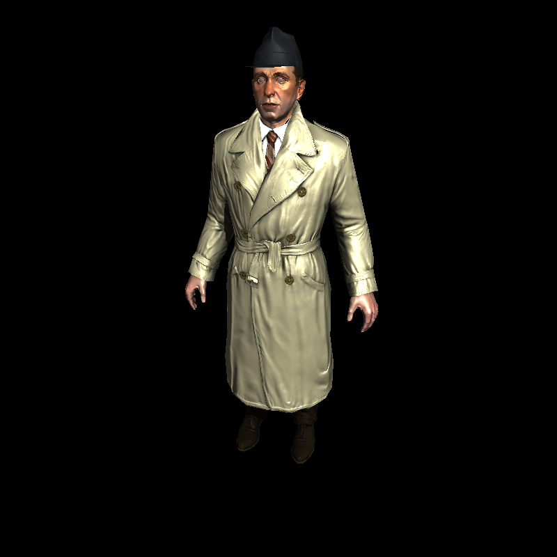

A simple CPU-based rasterization renderer implemented from scratch as a part of my computer graphics learning journey,

# Requirements

[`stb_image` and `stb_image_write`](https://github.com/nothings/stb) for image read and write.

[`eigen`](https://eigen.tuxfamily.org/index.php?title=Main_Page) for vector and matrix computation.

[`argparse`](https://github.com/p-ranav/argparse) for command-line arguments parse.

All of them are located in `external` already.

# Build

1. Clone this repository `git clone https://github.com/KeqiZeng/cpurenderer`.
2. Change directory to `cd cpurenderer`.
3. `make release`. The executable file `./build/cpurenderer` is generated.

# Gallery

`cpurenderer assets/african_head --camera_position 0.5 0.6 1.6 --light_position 1.5 2.5 2.5`
[

](images/african_head.png)

`cpurenderer assets/boggie --camera_position 0.4 0.8 1.6 --light_position 1.5 2.5 2.5`
[

](images/boggie.png)

`cpurenderer assets/boggie_on_floor --camera_position 0.8 1.2 2.4 --light_position 1.5 2.5 2.5`
[

](images/boggie_on_floor.png)

`cpurenderer assets/diablo3_pose --camera_position 0.5 0.6 1.6 --light_position 1.5 2.5 2.5`
[

](images/diablo3_pose.png)

`cpurenderer assets/diablo3_pose_on_floor --camera_position 0.8 1.2 2.4 --light_position 1.5 2.5 2.5`
[

](images/diablo3_pose_on_floor.png)

`cpurenderer assets/floor --camera_position 0.8 1.2 2.4 --light_position 1.5 2.5 2.5`
[

](images/floor.png)

# Key Features

✅ Complete graphics pipeline

✅ View frustum culling for model

✅ Back face culling for primitives

✅ Blinn-Phong reflection model

✅ Phong shader

✅ Texture mapping with bilinear interpolation and perspective correction

✅ Shadow map

✅ Theoretically programmable vertex and fragment shader

# Limitations

❌ Assume the OBJ models are triangulated

❌ No triangle clipping in clip space. If any vertex of an triangle is outside the clip space, the triangle will be discard. (to avoid annoying wrap-around issue). That's why the floor looks incomplete in some pictures.

# References

[`tinyrenderer`](https://github.com/ssloy/tinyrenderer)

[`GAMES 101`](https://sites.cs.ucsb.edu/~lingqi/teaching/games101.html)

# License

This project is licensed under the [MIT License](https://opensource.org/licenses/MIT).
